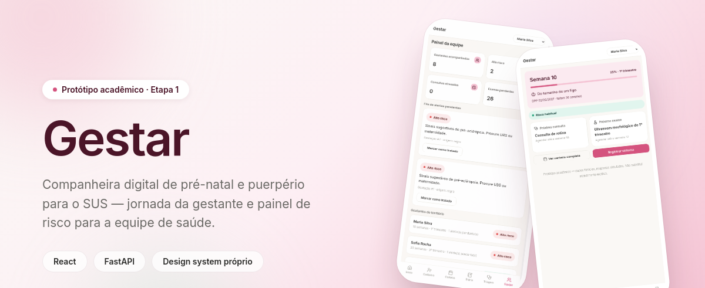
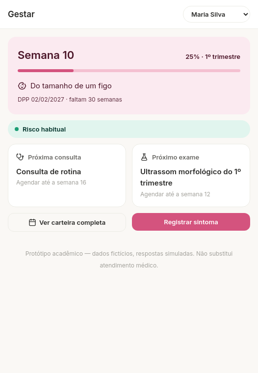
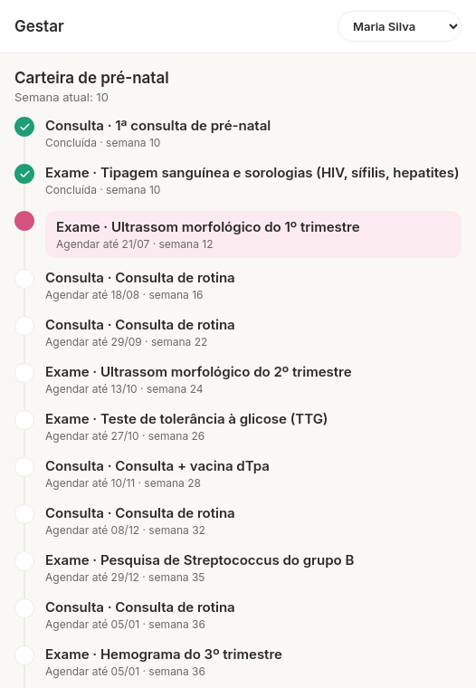
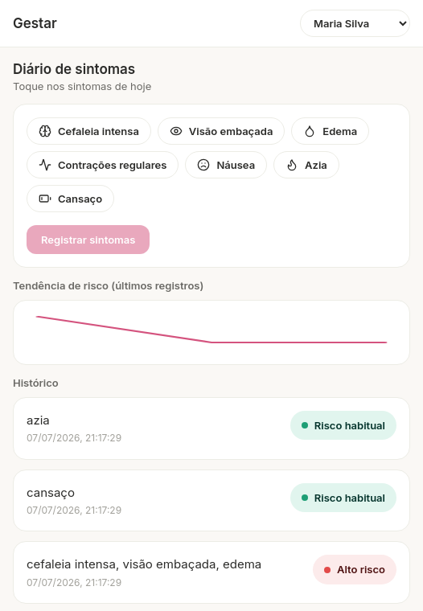
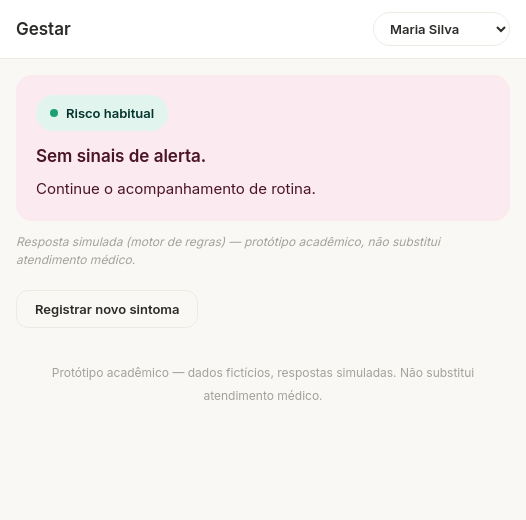
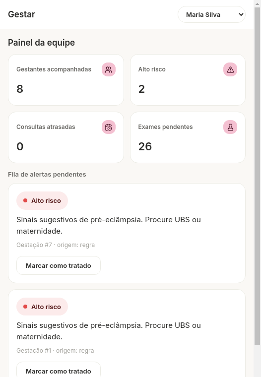
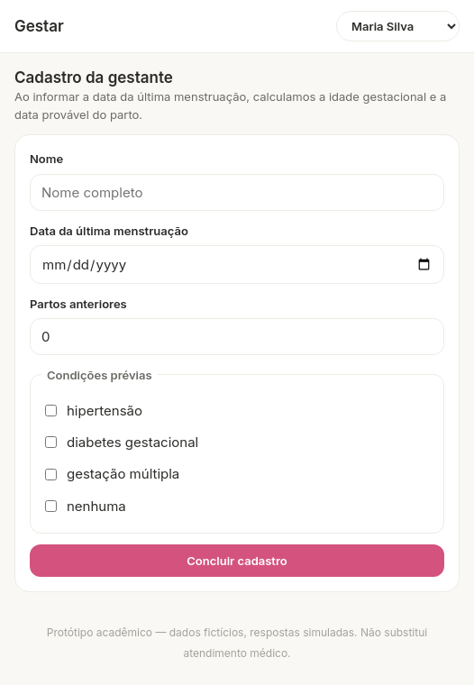

<p align="center">
  
</p>

<p align="center">
  
  
  
  
  
</p>

<p align="center">
  Protótipo de plataforma de acompanhamento da gestação e do puerpério, inspirado na
  jornada da <strong>Caderneta da Gestante</strong> do Ministério da Saúde — construído
  como avaliação da disciplina de IA Generativa (Pós-graduação em IA Aplicada,
  UniSENAI/FIESC).
</p>

<p align="center">
  <a href="SDD-gestar.md">Documento de design (SDD)</a> ·
  <a href="CLAUDE-design.md">Sistema de design da interface</a> ·
  <a href="PROMPTS.md">Processo com o agente de codificação</a>
</p>

---

> **Aviso de protótipo.** Todos os dados são fictícios (gerados por seed). Toda
> triagem é simulada por um motor de regras determinístico e rotulada como tal —
> nenhuma resposta vem de um modelo de IA nesta etapa, e nada aqui substitui
> atendimento médico.

## Sumário

- [Sobre o projeto](#sobre-o-projeto)
- [Escopo desta etapa](#escopo-desta-etapa)
- [Telas](#telas)
- [Arquitetura](#arquitetura)
- [Como rodar localmente](#como-rodar-localmente)
- [Referência da API](#referência-da-api)
- [Motor de triagem simulada](#motor-de-triagem-simulada)
- [Dados de demonstração (seed)](#dados-de-demonstração-seed)
- [Processo de desenvolvimento com o agente de codificação](#processo-de-desenvolvimento-com-o-agente-de-codificação)
- [Deploy](#deploy)
- [Limitações conhecidas e próximos passos](#limitações-conhecidas-e-próximos-passos)

## Sobre o projeto

O Brasil registra mortes maternas evitáveis em número incompatível com a cobertura
da atenção primária. A Caderneta da Gestante — principal instrumento de
acompanhamento do pré-natal no SUS — permanece em papel na maior parte dos
territórios, e equipes de saúde da família acompanham dezenas de gestantes com
pouca visibilidade sobre sinais de alerta entre consultas.

O Gestar propõe duas frentes conectadas pelo mesmo backend:

- **Jornada da gestante** (mobile-first): cadastro com cálculo automático de
  idade gestacional e DPP, carteira de pré-natal em linha do tempo, diário de
  sintomas com triagem e card de resultado.
- **Painel da equipe** (desktop): indicadores do território, fila de alertas
  com ação de tratamento e visão priorizada por risco.

## Escopo desta etapa

Este repositório implementa a **Etapa 1** do SDD: aplicação completa de UI,
navegável de ponta a ponta, com endpoint funcional — **sem nenhum modelo de IA**.
A triagem é feita por um motor de regras determinístico (ver
[Motor de triagem simulada](#motor-de-triagem-simulada)), e toda resposta vem
marcada com `"simulado": true`.

A **Etapa 2** (fora deste repositório nesta fase) substitui esse motor por um
pipeline de LLM com ferramentas e RAG sobre o protocolo do Ministério da Saúde,
mantendo o mesmo contrato de interface — ver seção 9 do SDD. Um bot de Telegram
para lembretes de consulta e orientações é uma ideia registrada para uma eventual
Etapa 3, documentada e fora do escopo avaliado por ora (seção 12 do SDD).

## Telas

Não há autenticação nesta etapa. Em vez disso, existe um seletor de "perfil
demo" no topo da tela que troca qual gestante fictícia está ativa em toda a
jornada; a escolha persiste no `localStorage` do navegador. A interface segue
o sistema de design em [`CLAUDE-design.md`](CLAUDE-design.md) — paleta rosé
acolhedora, referência em apps como Flo, Clue e Apple Health.

<table>
<tr>
<td width="33%" align="center">
  <br />
  <sub><b>Início</b> — progresso, chip de risco, próxima consulta/exame</sub>
</td>
<td width="33%" align="center">
  <br />
  <sub><b>Carteira</b> — timeline vertical de consultas e exames</sub>
</td>
<td width="33%" align="center">
  <br />
  <sub><b>Diário</b> — sintomas, intensidade e tendência de risco</sub>
</td>
</tr>
<tr>
<td width="33%" align="center">
  <br />
  <sub><b>Triagem</b> — resultado simulado com chip de risco</sub>
</td>
<td width="33%" align="center">
  <br />
  <sub><b>Painel da equipe</b> — KPIs, alertas, gestantes por risco</sub>
</td>
<td width="33%" align="center">
  <br />
  <sub><b>Cadastro</b> — nova gestante, cálculo automático de DPP</sub>
</td>
</tr>
</table>

<p align="right"><sub>Screenshots completas (página inteira) em <a href="docs/screenshots/">docs/screenshots/</a>.</sub></p>

| Rota | Tela |
|---|---|
| `/` | Início |
| `/onboarding` | Cadastro |
| `/carteira` | Carteira de pré-natal |
| `/diario` | Diário de sintomas |
| `/triagem` | Resultado da triagem |
| `/equipe` | Painel da equipe |

## Arquitetura

```
frontend (React 18 + Vite, react-router-dom)
   │  REST/JSON via /api (proxy do Vite em dev; mesma origem em produção)
   ▼
backend (FastAPI)
   ├── app/main.py                 rotas de gestante, equipe e triagem
   ├── app/services/triagem_mock.py  motor de regras (Etapa 1)
   └── estado em memória            sem banco nesta etapa (ver observação abaixo)
```

Em produção (Railway), o build do React é servido como estático pelo próprio
FastAPI (porta única) — ver [Deploy](#deploy).

**Observação sobre o SDD e o banco de dados.** O SDD (seção 4) especifica
PostgreSQL desde a Etapa 1, justificado pela continuidade com o pgvector da
Etapa 2. Nesta implementação da Etapa 1, o estado (gestantes, sintomas, alertas,
overrides da carteira) ainda vive em memória no processo do FastAPI, por
simplicidade enquanto o foco era fechar a navegação de ponta a ponta. Isso é uma
divergência assumida em relação ao SDD, não um requisito alterado: os dados são
perdidos a cada reinício do processo, e a migração para PostgreSQL via
SQLAlchemy é o próximo passo natural antes de (ou junto com) a Etapa 2 — ver
[Limitações conhecidas](#limitações-conhecidas-e-próximos-passos).

<details>
<summary><strong>Estrutura de pastas</strong></summary>

```
.
├── SDD-gestar.md              documento de design de produto (fonte da verdade)
├── CLAUDE-design.md           sistema de design da interface (tokens, componentes, regras por tela)
├── PROMPTS.md                 registro do processo com o agente de codificação
├── requirements.txt           dependências Python (backend)
├── Dockerfile                 build único para deploy (frontend + backend)
├── backend/
│   └── app/
│       ├── main.py            FastAPI: rotas + serve o build do frontend
│       └── services/
│           └── triagem_mock.py  motor de regras determinístico
├── frontend/
│   └── src/
│       ├── pages/             as 6 telas (uma por rota)
│       ├── components/ui/     Card, Chip, ProgressBar, Timeline, KpiCard, Sparkline...
│       ├── components/        NavBar, GestanteSwitcher
│       ├── context/           GestanteContext (perfil demo selecionado)
│       ├── lib/                risco.js, datas.js, tamanhoBebe.js (regras de apresentação)
│       ├── styles/tokens.css  fonte única de cor, espaçamento e raio
│       └── api.js             client fetch para o backend
└── docs/
    ├── banner.png              imagem de abertura deste README
    └── screenshots/            capturas de tela de cada rota
```

</details>

## Como rodar localmente

Requisitos: Python 3.12+ e Node 18+.

**1. Backend (porta 8000)**

```bash
cd backend
pip install -r ../requirements.txt
uvicorn app.main:app --reload --port 8000
```

**2. Frontend (porta 5173)**

```bash
cd frontend
npm install
npm run dev
```

Acesse `http://localhost:5173`. O Vite faz proxy de `/api/*` para
`http://127.0.0.1:8000` (configurado em `frontend/vite.config.js`), então as
duas partes conversam sem configuração extra de CORS.

<details>
<summary><strong>Rodando como em produção (porta única, sem Vite dev server)</strong></summary>

```bash
cd frontend && npm run build && cd ..
cd backend && uvicorn app.main:app --port 8000
```

Nesse modo o FastAPI detecta `frontend/dist` e passa a servir o React já
buildado na raiz (`/`), com a API continuando em `/api/*` — é exatamente o que
acontece no deploy (ver [Deploy](#deploy)).

</details>

## Referência da API

Todas as rotas abaixo estão sob o prefixo `/api`. Corpos de requisição/resposta
em JSON.

| Método | Rota | Descrição |
|---|---|---|
| GET | `/gestantes` | Lista todas as gestantes (com semanas/trimestre/DPP calculados) |
| POST | `/gestantes` | Cria gestante — `{nome, dum, paridade?, condicoes_previas?}` |
| GET | `/gestantes/{id}` | Detalhe de uma gestante |
| GET | `/gestantes/{id}/jornada` | Linha do tempo consolidada |
| GET | `/gestantes/{id}/carteira` | Itens da carteira (consultas + exames) por trimestre |
| PATCH | `/gestantes/{id}/carteira` | Atualiza status de um item — `{item_id, status}` |
| GET | `/gestantes/{id}/sintomas` | Histórico de registros do diário de sintomas |
| POST | `/gestantes/{id}/sintomas` | Registra sintomas e dispara a triagem — `{sintomas: string[], intensidade?: {sintoma: 1-5}}` |
| POST | `/gestantes/{id}/epds` | Registra respostas do EPDS e pontua — `{respostas: {}}` |
| GET | `/equipe/dashboard` | Contagem por nível de risco + resumo por gestante |
| GET | `/equipe/alertas` | Lista de alertas gerados pela triagem |
| PATCH | `/equipe/alertas/{id}` | Marca um alerta como tratado |

Toda resposta de triagem (`/sintomas` e `/epds`) inclui `"simulado": true`. O
campo `intensidade` é opcional e aditivo — só alimenta o histórico exibido na
interface, não influencia a lógica de triagem.

## Motor de triagem simulada

Implementado em `backend/app/services/triagem_mock.py` como regras
determinísticas — nenhuma chamada a LLM nesta etapa. Cenário principal de
demonstração (usado nos exemplos e screenshots deste README):

- **Cefaleia intensa + visão embaçada + edema, antes de 37 semanas → vermelho**
  (padrão compatível com pré-eclâmpsia; orientação de procurar UBS ou
  maternidade).
- Contrações regulares antes de 37 semanas → vermelho.
- EPDS ≥ 13 → vermelho; entre 10 e 12 → amarelo.
- Demais combinações → verde ou amarelo, com orientação de autocuidado.

O protocolo do SDD também prevê sangramento como sinal vermelho em qualquer
fase da gestação; essa regra continua implementada no motor (para fidelidade
clínica e testável via API), mas **não é exposta como opção no diário de
sintomas da interface** — decisão de produto para evitar um item sensível no
meio de demonstrações com público variado. O cenário de cefaleia/pré-eclâmpsia
é o caminho vermelho de referência na UI.

## Dados de demonstração (seed)

Oito gestantes fictícias são geradas em memória a cada início do backend, com
DUM calculada **relativa à data atual** (não fixa) — assim elas sempre aparecem
espalhadas de forma plausível entre o 1º e o 3º trimestre, não importa em que
dia o protótipo for demonstrado. Uma delas (Sofia Rocha) já nasce com um alerta
vermelho pendente, para que o painel da equipe seja demonstrável imediatamente
após subir a aplicação, sem precisar registrar sintomas manualmente primeiro.

## Processo de desenvolvimento com o agente de codificação

O histórico completo de prompts, resultados e ajustes está em
[`PROMPTS.md`](PROMPTS.md), incluindo os bugs encontrados e corrigidos durante
o processo e o redesign visual completo feito a partir de
[`CLAUDE-design.md`](CLAUDE-design.md). As screenshots referenciadas ali estão
em `docs/screenshots/`.

## Deploy

Deploy pensado para o Railway, com o build do React servido pelo próprio
FastAPI em uma única porta (ver `Dockerfile` na raiz do repositório). O backend
lê a porta da variável de ambiente `PORT` (padrão do Railway) e serve
`frontend/dist` automaticamente quando o diretório existe. Instruções de deploy
estão no próprio `Dockerfile` e foram validadas localmente
(`docker build` + `docker run`) antes do primeiro deploy.

## Limitações conhecidas e próximos passos

- **Sem banco de dados ainda**: estado em memória, perdido a cada reinício do
  processo — ver observação em [Arquitetura](#arquitetura). Migração para
  PostgreSQL via SQLAlchemy é o próximo passo antes da Etapa 2.
- **Sem autenticação**: o seletor de "perfil demo" substitui login nesta etapa,
  conforme escopo definido no SDD para a Etapa 1.
- **Puerpério/EPDS e conteúdo educativo**: os endpoints existem
  (`/epds`), mas ainda não têm tela dedicada — não fazem parte das 6 telas
  priorizadas nesta rodada.
- **Etapa 2 (triagem por LLM) e eventual bot de Telegram**: fora do escopo
  deste repositório; ver seções 9 e 12 do SDD.
